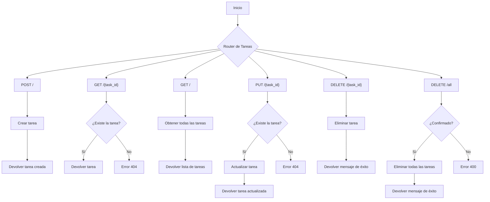

```mermaid
graph TD
    A["Inicio"] --> B{"Router de Tareas"}
    B --> C["POST /"]
    B --> D["GET /{task_id}"]
    B --> E["GET /"]
    B --> F["PUT /{task_id}"]
    B --> G["DELETE /{task_id}"]
    B --> H["DELETE /all"]

    C --> C1["Crear tarea"]
    C1 --> C2["Devolver tarea creada"]

    D --> D1{"¿Existe la tarea?"}
    D1 -->|Sí| D2["Devolver tarea"]
    D1 -->|No| D3["Error 404"]

    E --> E1["Obtener todas las tareas"]
    E1 --> E2["Devolver lista de tareas"]

    F --> F1{"¿Existe la tarea?"}
    F1 -->|Sí| F2["Actualizar tarea"]
    F2 --> F3["Devolver tarea actualizada"]
    F1 -->|No| F4["Error 404"]

    G --> G1["Eliminar tarea"]
    G1 --> G2["Devolver mensaje de éxito"]

    H --> H1{"¿Confirmado?"}
    H1 -->|Sí| H2["Eliminar todas las tareas"]
    H2 --> H3["Devolver mensaje de éxito"]
    H1 -->|No| H4["Error 400"]

```